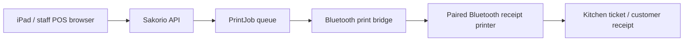

# Sakorio Bluetooth Receipt Printing Workflow

Date: 2026-08-11  
Scope: Bluetooth-only receipt printer support for Sakorio POS launch testing

## Executive summary

Sakorio can support Bluetooth receipt printing by keeping the existing durable
print-job queue and adding Bluetooth as a delivery transport. The POS browser
does not print directly. Instead, Sakorio creates print jobs when orders are
sent to kitchen/bar and when bills are paid. A nearby print bridge leases those
jobs and sends ESC/POS data to the Bluetooth receipt printer.

This keeps Bluetooth printing operationally similar to Loyverse: staff use the
POS normally, while a local device maintains the printer connection in the
background.

## Current implementation status

Implemented in this pass:

1. `printer-agent` now supports two transports:
   - `network`: WiFi/LAN printer by IP and TCP port, default `9100`.
   - `bluetooth_serial`: paired Bluetooth printer exposed by the operating
     system as a serial port.
2. `printer-agent/.env.example` now includes Bluetooth serial configuration.
3. `printer-agent/README.md` now includes Bluetooth setup and launch notes.
4. Staff Printing Settings copy now explains WiFi/LAN and paired Bluetooth
   serial bridge setup.

No existing WiFi/LAN print path was removed.

## Production workflow



## Why the browser does not print directly

iPad Safari/Chrome is not a reliable production path for silent ESC/POS
Bluetooth receipt printing. Loyverse works because it is a native app with
hardware-level Bluetooth access. Sakorio is a web POS, so the safe design is:

- browser creates the order/payment;
- backend creates durable print jobs;
- a trusted print bridge handles Bluetooth delivery;
- backend records completed/failed delivery.

## Supported Bluetooth path now

Use this path when the printer can be paired to a device and appears as a serial
port.

Examples:

- Windows: `COM5`, `COM6`.
- macOS: `/dev/cu.*`.
- Linux/Raspberry Pi: `/dev/rfcomm*`.

Required bridge environment:

```env
API_BASE_URL=https://api.sakorio.com
PRINTER_AGENT_TOKEN=token-created-in-sakorio
PRINTER_TRANSPORT=bluetooth_serial
PRINTER_SERIAL_PORT=COM5
PRINTER_SERIAL_BAUDRATE=9600
PRINTER_SERIAL_TIMEOUT_SECONDS=10
PRINTER_ENCODING=cp437
PRINTER_DRY_RUN=false
```

Optional dependency:

```bash
python -m pip install pyserial
```

## If the shop has only iPad + Bluetooth printer

There are two possible launch paths:

### Path A — add a small bridge device

Use a small always-on device near the printer:

- Windows mini PC;
- old laptop;
- Raspberry Pi / Linux mini box;
- Android bridge device if later implemented.

The iPad remains the POS. The bridge handles Bluetooth printing.

### Path B — build a native iPad printer companion app

If the printer vendor provides an iOS SDK, a native iPad companion app can lease
jobs from Sakorio and print through the vendor Bluetooth API. This is closest to
the Loyverse model but requires native iOS development and physical hardware
testing.

The native app should use the existing Sakorio endpoints:

1. `POST /printer-agent/heartbeat`
2. `POST /printer-agent/jobs/lease?limit=5`
3. `POST /printer-agent/jobs/{job_id}/complete`
4. `POST /printer-agent/jobs/{job_id}/fail`

It should authenticate with `X-Printer-Agent-Token`.

## Launch acceptance checklist

Run this in the restaurant before going live:

1. Pair printer to the bridge device.
2. Confirm the serial port name.
3. Create one Sakorio printer agent token in Settings → Printing.
4. Start the printer bridge with `PRINTER_DRY_RUN=true`.
5. Send a kitchen order and confirm a dry-run receipt file is created.
6. Switch to `PRINTER_DRY_RUN=false`.
7. Send one kitchen item; verify ticket prints.
8. Send one bar/drink item; verify correct ticket route or shared printer.
9. Pay one order; verify customer receipt prints once.
10. Power off printer, submit one order, power printer back on, and confirm retry
    behaviour is acceptable.
11. Move iPad to normal service distance and confirm POS remains smooth.
12. Sleep/wake iPad; confirm printing still works because bridge, not iPad
    browser, owns printing.
13. Restart bridge device; confirm agent comes back online in Printing Settings.
14. Confirm failed jobs are visible in the delivery log.
15. Disable old/stale printer tokens before launch.

## Operational recommendation

For Bluetooth-only hardware, keep one small bridge device in the shop. It can be
hidden near the cashier/printer, starts automatically at boot, and keeps the
receipt printer connection stable while staff continue using iPads for POS.

If the final printer only supports vendor iOS Bluetooth SDK and does not expose
Bluetooth serial, treat the native iPad companion app as the required next
development phase.
