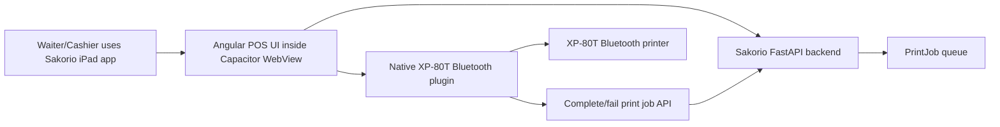

# Sakorio XP-80T iPad App Compatibility Build Brief

Date: 2026-08-18  
Target hardware: Xprinter XP-80T Bluetooth + USB receipt printer  
Target POS device: iPad used by cashier/waiter  
Primary goal: make Sakorio compatible with XP-80T Bluetooth receipt printing in a Loyverse-style workflow

## 1. Executive decision

Sakorio should support XP-80T by turning the staff POS into a native iPad app shell and adding a native Bluetooth printing layer.

The current Sakorio web app should not be thrown away. The correct build is:

```text
Existing Angular staff POS
→ Capacitor iOS app wrapper
→ native Bluetooth printer plugin
→ XP-80T Bluetooth receipt printer
```

This is a medium-complexity build, not a full system rebuild. Most of Sakorio stays the same: Angular UI, FastAPI backend, PostgreSQL database, HitPay payment flow, order queue, KDS, reservations, tables, and receipt job models. The main new work is the native iPad printing layer.

## 2. Why this is needed

Loyverse can print directly to Bluetooth printers because it is a native iPad app with hardware access.

Sakorio is currently a web app:

```text
iPad Safari / Chrome
→ Sakorio web POS
```

That browser-only setup cannot reliably perform silent ESC/POS Bluetooth receipt printing. iOS Bluetooth access for production apps should go through native app APIs such as Core Bluetooth or a vendor SDK.

So the launch-safe target becomes:

```text
Sakorio iPad app
→ native Bluetooth layer
→ XP-80T
```

## 3. Hardware assumptions

Target printer:

- Model: XP-80T
- Variant: Bluetooth + USB
- Paper: 79.5mm / 80mm receipt roll
- Print width: 72mm
- Resolution: 203 DPI
- Speed: around 200mm/s
- Expected command format: ESC/POS-style receipt data
- Expected feature: auto-cutter

Before final build acceptance, confirm with seller or hardware test:

1. XP-80T Bluetooth version works with iPad/iOS POS apps.
2. It supports ESC/POS commands.
3. It supports auto-cutter.
4. It can receive raw receipt bytes through BLE, vendor SDK, or supported iOS Bluetooth channel.
5. It does not require a proprietary-only Android app.

## 4. Recommended technical architecture

### 4.1 Current Sakorio printing foundation

Sakorio already has a good backend foundation:

- `PrinterAgent`
- `PrintJob`
- durable print-job queue
- kitchen/bar/customer receipt payloads
- job leasing endpoint
- success/failure reporting endpoint
- retry/backoff behavior
- current local `printer-agent` for WiFi/LAN or Bluetooth serial bridge

This should remain the source of truth.

### 4.2 New iPad app print architecture



### 4.3 Why keep backend print jobs?

Do not make the iPad app print only from frontend state. Keep backend print jobs because they provide:

- idempotency;
- retry tracking;
- kitchen/customer receipt consistency;
- audit trail;
- failed-printer visibility;
- future support for kitchen printer, cashier printer, and bridge devices;
- no duplicate receipts after refresh/payment callback.

## 5. App stack proposal

### 5.1 App shell

Use Capacitor.

Recommended packages:

```text
@capacitor/core
@capacitor/cli
@capacitor/ios
```

Reason:

- reuses Angular frontend;
- produces a native iOS app;
- allows Swift native plugins;
- keeps one main codebase;
- supports app-store or private/internal iPad installation later.

### 5.2 Native Bluetooth layer

Preferred order:

1. Xprinter official iOS SDK, if seller provides one.
2. Custom Capacitor plugin using Core Bluetooth if XP-80T exposes BLE write service/characteristic.
3. MFi / ExternalAccessory route if the printer uses Apple-approved Classic Bluetooth protocol.
4. Keep existing `printer-agent` bridge as fallback if direct iPad Bluetooth is blocked by printer protocol.

### 5.3 Receipt format

Continue rendering receipts as ESC/POS bytes.

Current receipt rendering exists in:

```text
printer-agent/agent.py
```

For the iPad app, move or duplicate this logic into a shared receipt renderer:

```text
front/src/app/printing/escpos-receipt.renderer.ts
```

or backend-generated byte/base64 payload:

```text
Sakorio API returns rendered ESC/POS base64
→ iPad native plugin sends bytes to XP-80T
```

Preferred approach for consistency:

```text
Backend owns receipt payload
Frontend/iPad app owns device delivery
Shared tests verify exact receipt content
```

## 6. Required Sakorio system changes

### Phase 1 — prepare app wrapper

Add Capacitor to the Angular frontend.

Expected files:

```text
front/capacitor.config.ts
front/ios/
front/src/app/services/native-platform.service.ts
```

Tasks:

1. Add Capacitor dependencies.
2. Configure app name: `Sakorio POS`.
3. Configure app id, for example: `com.sakorio.pos`.
4. Configure production URL/build output.
5. Ensure Angular routing works inside iOS WebView.
6. Ensure staff login/session persists inside app.
7. Add native platform detection.

### Phase 2 — expose print queue to iPad app

Current `/printer-agent` endpoints are token-based and already useful.

For iPad app printing, create an iPad printer client mode:

```text
POST /printer-agent/heartbeat
POST /printer-agent/jobs/lease?limit=5
POST /printer-agent/jobs/{job_id}/complete
POST /printer-agent/jobs/{job_id}/fail
```

Possible improvement:

```text
GET /printing/app-config
POST /printing/app-pair
```

Purpose:

- pair iPad app with tenant;
- store token securely in iOS Keychain;
- allow staff/admin to disable old devices;
- show iPad printer app online in Printing Settings.

### Phase 3 — add native XP-80T printer plugin

Create a Capacitor plugin:

```text
front/ios/App/App/Plugins/Xp80tPrinterPlugin.swift
front/src/app/native/xp80t-printer.ts
```

Plugin responsibilities:

1. request Bluetooth permission;
2. scan for XP-80T printer;
3. connect;
4. remember selected printer identifier;
5. send ESC/POS bytes;
6. return success/failure;
7. expose connection state to Angular;
8. reconnect safely after app foreground/background transitions.

Expected TypeScript interface:

```ts
export interface Xp80tPrinterPlugin {
  requestPermissions(): Promise<{ bluetooth: 'granted' | 'denied' }>;
  scan(): Promise<{ devices: Xp80tDevice[] }>;
  connect(options: { deviceId: string }): Promise<{ connected: boolean }>;
  disconnect(): Promise<void>;
  print(options: { jobId: number; payloadBase64: string }): Promise<{ printed: boolean }>;
  getStatus(): Promise<{ connected: boolean; deviceName?: string }>;
}
```

### Phase 4 — app-side print worker

Inside Angular, add a service:

```text
front/src/app/services/ipad-printer-worker.service.ts
```

Responsibilities:

1. start only inside native iPad app;
2. call heartbeat every 15–30 seconds;
3. lease jobs every 2–5 seconds when printer is connected;
4. convert receipt payload to ESC/POS bytes or consume backend-rendered bytes;
5. call native plugin print method;
6. mark job complete/fail;
7. show visible printer status in the staff POS header/settings.

Pseudo-flow:

```text
if native iPad app and printer paired:
  heartbeat
  lease jobs
  for each job:
    render receipt
    bluetooth print
    if success → mark complete
    if fail → mark failed with exact error
```

### Phase 5 — UI changes

Add or refine these staff UI areas:

1. Settings → Printing:
   - `Pair XP-80T Bluetooth printer`
   - `Test print`
   - `Connected printer: XP-80T`
   - `Last print success`
   - `Failed jobs`

2. POS header:
   - small printer status pill:
     - `Printer connected`
     - `Printer offline`
     - `Receipt pending`

3. Payment success:
   - `Receipt printing...`
   - `Receipt printed`
   - `Printer offline — receipt queued`

4. Kitchen send:
   - `Kitchen ticket queued`
   - `Kitchen ticket printed`
   - `Printer offline — retrying`

## 7. iPad configuration steps

### 7.1 Before installing Sakorio app

On the iPad:

1. Update iPadOS to current stable version.
2. Enable Bluetooth.
3. Disable Low Power Mode during testing.
4. Keep WiFi connected for Sakorio backend access.
5. Set Auto-Lock to a longer duration during service, for example 10–15 minutes.
6. Allow notifications if the app uses print failure alerts later.

### 7.2 Pair printer

1. Power on XP-80T.
2. Enter Bluetooth pairing mode according to printer manual.
3. On iPad, open Settings → Bluetooth.
4. Pair with XP-80T if it appears.
5. If printer does not appear in iPad Bluetooth settings, test through the native app scan because some BLE peripherals pair inside the app rather than iOS Settings.

### 7.3 App permissions

The iOS app must include:

```xml
<key>NSBluetoothAlwaysUsageDescription</key>
<string>Sakorio uses Bluetooth to connect to the restaurant receipt printer.</string>
```

If background printing/reconnect is needed:

```xml
<key>UIBackgroundModes</key>
<array>
  <string>bluetooth-central</string>
</array>
```

Launch note: printing should be tested with the app in foreground first. Background behavior is secondary and more sensitive on iOS.

## 8. Backend API changes

Minimum backend changes:

1. Keep current `PrintJob` table.
2. Keep current print job leasing endpoints.
3. Add device metadata to `PrinterAgent`, if useful:
   - `device_type`: `local_agent`, `ipad_app`, `xp80t`
   - `transport`: `network`, `bluetooth_serial`, `ios_bluetooth`
   - `last_error_code`
   - `last_error_at`

Potential migration:

```sql
ALTER TABLE printer_agent
ADD COLUMN device_type VARCHAR(32),
ADD COLUMN transport VARCHAR(32),
ADD COLUMN app_version VARCHAR(64);
```

This is optional for MVP but useful for operations.

## 9. Frontend changes

Minimum:

1. Add native platform detection.
2. Add iPad printer pairing UI in Printing Settings.
3. Add print status service.
4. Add print status badges in POS/Kitchen/Payment flows.
5. Add test print button.

Recommended UI status states:

```text
Not configured
Bluetooth permission needed
Scanning
Printer found
Connected
Printing
Printed
Queued for retry
Printer disconnected
```

## 10. Native printer plugin technical notes

### 10.1 If XP-80T uses BLE

The plugin needs:

- scan for peripherals;
- discover services;
- identify writable characteristic;
- chunk ESC/POS bytes into MTU-safe packets;
- write with or without response depending on printer support;
- delay between chunks if printer buffer is small;
- report completion only after all chunks are written.

Important: BLE receipt printers often need byte chunking. Do not send one huge receipt payload in a single write.

### 10.2 If XP-80T uses Classic Bluetooth / MFi

The plugin may need:

- vendor SDK; or
- Apple ExternalAccessory framework;
- supported protocol string from printer manufacturer.

If the printer is not MFi and only supports Android/Windows SPP, direct iPad printing may not be possible. In that case use the small bridge device path.

## 11. Fallback architecture

If direct iPad Bluetooth fails, Sakorio still has a valid fallback:

```text
iPad Sakorio web/app
→ Sakorio backend
→ small local bridge device
→ XP-80T Bluetooth serial
→ receipt prints
```

This fallback is already partly implemented through:

```text
printer-agent/agent.py
PRINTER_TRANSPORT=bluetooth_serial
```

So the build should support both:

1. native iPad direct Bluetooth; and
2. external Bluetooth bridge.

## 12. Security requirements

1. Printer pairing token must be generated by authorized admin/manager only.
2. Store token in iOS Keychain, not localStorage.
3. Never expose API keys or backend secrets in the app bundle.
4. Printer agent/app token must be revocable from Settings.
5. All print-job APIs must remain tenant-scoped.
6. Job completion must require valid lease token.
7. Avoid logging full customer payment details.
8. Log printer failures, not sensitive customer data.

## 13. Testing strategy

### 13.1 Internal software tests

Continue running:

```powershell
python printer-agent/test_agent.py
docker exec pos-back python -m pytest -q tests/test_printing_service.py
docker exec pos-front npm run build -- --configuration production-static
```

Add future tests:

- ESC/POS renderer snapshot test.
- receipt chunking test;
- duplicate print prevention test;
- failed print retry test;
- iPad app printer worker polling test;
- test print endpoint/UI test.

### 13.2 Physical XP-80T acceptance tests

Run on real iPad + real XP-80T:

1. Install Sakorio iPad app.
2. Login as staff.
3. Allow Bluetooth permission.
4. Pair/select XP-80T.
5. Run test print.
6. Send kitchen order.
7. Confirm kitchen ticket prints.
8. Add second round order.
9. Confirm second kitchen ticket prints once.
10. Pay via terminal.
11. Confirm customer receipt prints once.
12. Close table.
13. Confirm no extra duplicate receipt.
14. Turn printer off and create test order.
15. Confirm job is queued/failed visibly.
16. Turn printer on.
17. Confirm retry/reprint path works.
18. Put iPad to sleep and wake.
19. Confirm reconnect behavior.
20. Restart app and confirm selected printer is remembered.

## 14. Step-by-step developer build plan

### Step 1 — confirm hardware protocol

Before coding native Bluetooth deeply:

1. Obtain XP-80T.
2. Ask seller for iOS SDK or BLE protocol documentation.
3. Confirm whether printer is BLE, MFi Classic, or app-only proprietary.
4. Print one sample receipt from any available iOS SDK/demo app.

Exit criteria:

- We know exactly how bytes are sent to XP-80T from iOS.

### Step 2 — create Capacitor iOS app

1. Add Capacitor dependencies.
2. Initialize Capacitor in `front`.
3. Build Angular production output.
4. Add iOS project.
5. Open in Xcode.
6. Run on real iPad.
7. Confirm login, POS, tables, menu, payment pages load.

Exit criteria:

- Sakorio works as an iPad app without printing.

### Step 3 — create native printer plugin

1. Add plugin shell.
2. Add Bluetooth permission description.
3. Add scan/connect methods.
4. Add write/print method.
5. Add TypeScript bridge.
6. Test with small text receipt.
7. Test auto-cutter command.

Exit criteria:

- iPad app can print a test receipt to XP-80T.

### Step 4 — connect plugin to Sakorio print queue

1. Pair iPad app as printer agent.
2. Store token securely.
3. Lease jobs from backend.
4. Render or receive ESC/POS bytes.
5. Send to XP-80T.
6. Mark complete/fail.

Exit criteria:

- A real Sakorio order produces a real printed kitchen/customer receipt.

### Step 5 — improve UI/UX

1. Add printer status badge.
2. Add test print button.
3. Add failure banners.
4. Add “queued for retry” messaging.
5. Add disable/re-pair flow.

Exit criteria:

- Staff can understand and recover printer state without developer help.

### Step 6 — production hardening

1. Reconnect after app sleep/wake.
2. Handle Bluetooth permission denied.
3. Handle printer not found.
4. Handle low battery/offline printer.
5. Prevent duplicate prints.
6. Add app version visibility.
7. Add launch runbook.

Exit criteria:

- XP-80T printing survives real restaurant usage patterns.

## 15. Estimated effort

| Work area | Estimate |
| --- | ---: |
| Capacitor app wrapper | 1–2 days |
| Login/session/native app polish | 0.5–1 day |
| Bluetooth plugin proof of concept | 2–5 days, depends on printer protocol |
| Receipt queue integration | 1–2 days |
| UI printer status/recovery | 1–2 days |
| Physical QA and fixes | 2–4 days |

Total realistic estimate:

```text
Best case: 1 week
Normal case: 2 weeks
If printer protocol is difficult/proprietary: 3+ weeks or bridge fallback
```

## 16. Go / no-go criteria

Sakorio XP-80T app printing is launch-ready only when:

1. test print works from real iPad to XP-80T;
2. kitchen ticket prints automatically after order submit;
3. customer receipt prints once after payment;
4. disconnects are visible and recoverable;
5. duplicate prints are prevented;
6. failed jobs can be retried;
7. staff can re-pair printer without developer support;
8. app survives sleep/wake/restart;
9. backend print queue remains clean;
10. physical restaurant rehearsal passes.

## 17. Sources checked

- Xprinter XP-80T official specs: https://www.xprinter.net/product/733.html
- Apple Core Bluetooth documentation: https://developer.apple.com/documentation/corebluetooth/
- Capacitor overview/docs: https://capacitorjs.com/docs
- Capacitor iOS/plugin guidance: https://capacitorjs.com/docs/plugins/ios
- Capacitor BLE plugin reference: https://github.com/capacitor-community/bluetooth-le

## 18. Final recommendation

Build Sakorio XP-80T compatibility in two tracks:

1. Native iPad app track using Capacitor + XP-80T Bluetooth plugin.
2. Backup bridge track using the existing `printer-agent` with
   `PRINTER_TRANSPORT=bluetooth_serial`.

This gives Sakorio the best chance of matching the Loyverse-style Bluetooth
experience while protecting the restaurant from printer downtime during launch.
